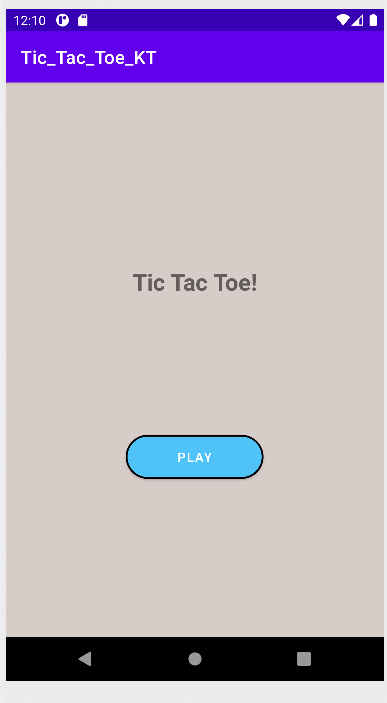
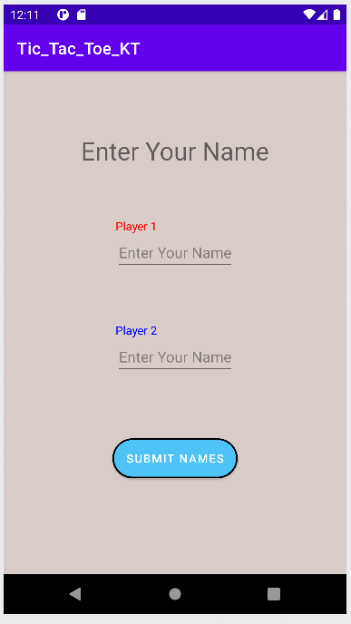
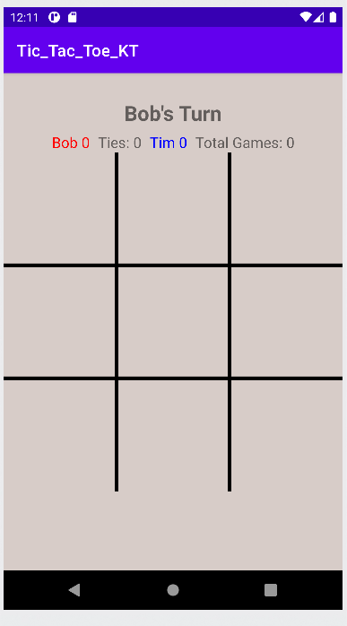
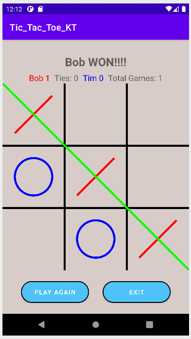

# kotlin_tic_tac_toe
Tic Tac Toe app made in kotlin.

App has simple open game button  
 
 

Once button is clicked goes to where the player can enter names.
There is a safety in place to where the player has to enter a name to continue to the game.  

 

Game opens up to a blank board with the record at top and the players turn.  

 

At the end of the game the record system updates and the players can choose to play again or exit to main menu. 
Exiting to main menu resets record system for new players. 

 

Project is based on [Android Studio Java Tutorial by Practical Coding](https://youtube.com/playlist?list=PLcSIMAULmMyftO2SvNGE5mmYKKeAWCJUm) but is written in Kotlin instead of Java
